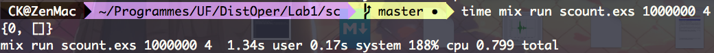
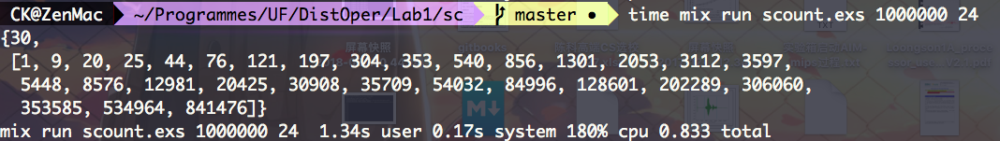
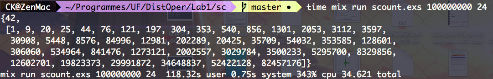
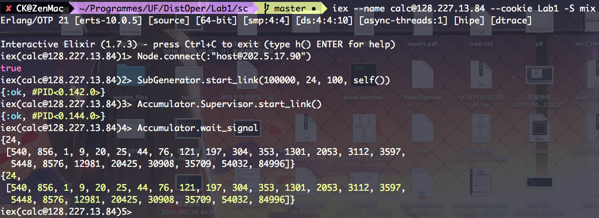
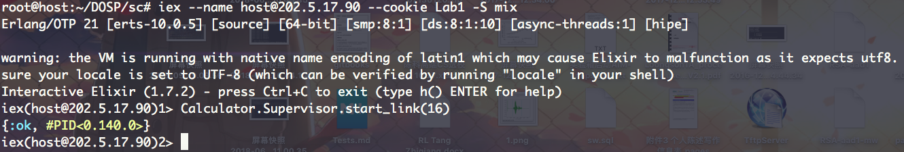
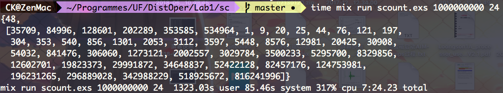

# SquareCount

Github: https://github.com/hqpwca/DOSP-Lab.git

## Group Info
* Ke Chen 8431-0979
* Bochen Li 4992-9405

## Requirements & Running Environments

* Erlang/OTP 21 [erts-10.0.5] [source] [64-bit] [smp:4:4] [ds:4:4:10] [async-threads:1] [hipe] [dtrace]
* Elixir 1.7.3 (compiled with Erlang/OTP 21)

* Environments: Mac OS X 10.12

##Algorithm

###Formula

In this project, I used the formula of sum of squares to calculate the value.

`1^2 + 2^2 + 3^2 + ... + n^2 = n * (n+1) * (2n+1)`

To get the values required, just simply minus 2 formulas. So it consumes `O(1)` to calculate each sum of squares.

###Supervisor

Use the Supervisor in Elixir to prevent the actors accidentally break down.

###Concurrency

Use the pending pool to prevent the broken actor affect the final result.

First, the calculator will send a message, ask the subproblem generator for a new subproblem. The subproblem generator will generate the problem. When a subproblem generated, it will be put into the pending pool(stored in the state of the actor), then send to the calculator actor. After the calculator actor finished, it will sent the result with message to the accumulator actor. The accumulator will add the result to the final result before finally send the processed message to the subproblem generator, the subproblem generator will then remove that problem from the pending pool.

In this way, the abort of individual calculator actor will not affect the final result of the problem.

###Subproblem size determine

Since the subproblem is O(n) with the n as the number of sums of squares it contains, so that we need to make the subproblem generator and accumulator to do  same load of work as the calculator.

In order to achieve that, we make that each subproblem size equals the number of the subproblems, so the subproblem size should be `sqrt(N)`. (We actually use `sqrt(N)/2` because the constant in the running time of the subproblem generator and the accumulator is larger than the calculator)

## Instruction

### Command Line (Single Node):

`mix run scount.exs [N] [k]`
> `N` is the maximum number of the calculation, and `k` is the length of each sum of squares.(subproblem size = `sqrt(N)/2`, num of calculator actors = `16`)

`time mix run scount.exs [N] [k]`
> Get the running time of the program.

### Running from iex (Single Node):
* To start iex: `iex -S mix`
* Start Subproblem Generatror: `SubGenerator.start_link([N],[k],[size], self())`

> `N` is the maximum number of the calculation
> 
> `k` is the length of each sum of squares
> 
> `size` is the quantity of sum of squares that each subproblem needs to calculate.

* Start Accumulator: `Accumulator.Supervisor.start_link`
* Start Calculation: `Calculator.Supervisor.start_link([calc_num])`

> `calc_num` is the number of calculator actor created.

* Get Result: `Accumulator.wait_signal`

### Running from iex (Distributed):
* Copy the program to all the nodes.
* Start iex with name and cookies: `iex --name [name]@[ip] --cookie [your cookie] -S mix`
* Use one of the computer as the host.
* Run `Node.connect(:"[host name]@[host ip]")` in each node except the host to connect all the nodes.
* Run each part of the program in the nodes as if using a single computer.

##Results

###Result of problem [1000000, 4]

Since I have used the formula to calculate, the problem is to small to get all the 4 cores running.

###Result of problem [1000000, 24]

Showing that the program can get correct result.

###Result of problem [100000000, 24]

Showing that the program can use all the 4 cores to calculate the problem. (The CPU Usage is over 300%)

###Result of problem [100000, 24]  -(2 Nodes)

Since I used my vps for the calculation node, the Internet connection between the 2 nodes is too slow to solve the large problems, so I just tried small problems in the 2 nodes. However, the distributed version should be able to calculate large problems when the connection is better.

###The largest problem solved [1000000000, 24]

I tried to solve the problem while I am writing the readme, so the CPU usage is not so high. I haven't tried a so large problem since it has no meaning.

